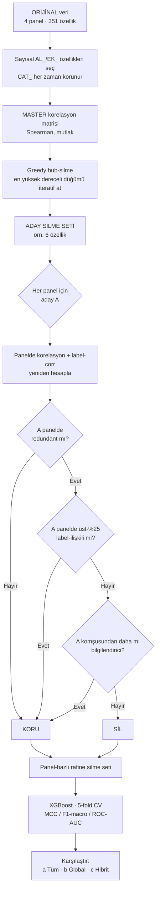

# Korelasyon-Hibrit Özellik Silme (Hub-Farkında, Panel-Bazlı)

Bu belge, projede uygulanan **hibrit korelasyon-tabanlı sütun silme** yönteminin
amacını, çalışma mantığını, akış şemasını ve sonuçlarını özetler.

İlgili kod: [`KODLAR/ORTAK/run_hybrid_corr_drop.py`](../../KODLAR/ORTAK/run_hybrid_corr_drop.py)
Çıktılar: `hibrit_korelasyon_sonuclar_XGBOOST.csv`, `silinen_ozellikler.json`

---

## 1. Amaç / Problem

Korelasyon-tabanlı sütun silme tüm panellerin havuzlandığı **MASTER** üzerinden
*global* yapıldığında, küçük gen panellerinin (özellikle **CFTR** ve **PAH**)
skorları düşüyordu. Sebep: korelasyon **veriye bağlıdır**. MASTER farklı genleri
tek havuzda topladığında bazı özellikler **birebir aynı (corr = 1.0)** görünür;
ancak bu bir **havuzlama (pooling) artefaktıdır** — tek bir panelin içinde aynı
özellikler ya değişkendir ya sabittir, yani **panel içinde aslında redundant
değildir**. Global silme, panelde gerçekten sinyal taşıyan özelliği "MASTER'da
kopya" diye attığı için küçük panelleri bozar.

## 2. Hub Kuralı (en az özellik kaybı)

> A sütunu B, C, D ile yüksek korelasyonlu **ama B, C, D birbirleriyle değil** →
> B/C/D'yi tek tek silmek 3 özellik kaybettirir. Bunun yerine **hub olan A'yı**
> silmek 1 özellik kaybıyla redundansı çözer.

Bu, korelasyon grafiğinde **iteratif olarak en yüksek dereceli (en çok partnerli)
düğümü silerek** uygulanır (greedy hub removal). Tam kopya kümelerinde (klik) ise
doğal olarak **tek bir temsilci bırakılır**, gerisi atılır.

## 3. Hibrit Mantık (MASTER + panel)

1. **Aday set MASTER'dan:** En güvenilir korelasyon yapısı için aday silme listesi
   MASTER üzerinden hub-silme ile çıkarılır.
2. **Panel-farkında koruma:** Her panelde aday `A` şu **iki koşul birden**
   sağlanırsa silinir:
   - (i) `A` o panelde **hâlâ redundant** (korunan bir özellikle `|corr| ≥ T`), **ve**
   - (ii) `A` o panel için label'a **en iyi komşusundan daha az bilgilendirici**.
   Aksi halde (panelde redundant değil **veya** panel için daha bilgilendirici
   **veya** panelde üst-%25 label-ilişkili) → **A korunur**.

Parametreler: `T = 0.85` (Spearman, mutlak) · korelasyon-silme yalnız sayısal
`AL_/EK_` özelliklerde (kategorik `CAT_*` her zaman korunur — kod-artefaktı
korelasyonu önlemek için) · koruma tabanı = panel label-corr 75. yüzdelik.

## 4. Akış Şeması



## 5. Somut Hub Örneği (MASTER)

MASTER hub-silme 6 özelliği aday gösterdi. Bunlar MASTER'da **tam kopya kümesi**:

```
AL_200 = AL_204 = AL_227 = AL_240 = AL_267 = AL_269   (hepsi corr = 1.00)
AL_216 = AL_252                                         (corr = 1.00)
```

Hub kuralı: 6'lı klikten **AL_269 temsilci bırakılıp** diğer 5'i silindi; ikiliden
**AL_252 bırakılıp AL_216** silindi → **silinen toplam 6** (`AL_200, AL_204, AL_227,
AL_240, AL_267, AL_216`).

Aynı çiftlerin **CFTR/PAH/KANSER içindeki korelasyonu tanımsız (NaN)** — yani panel
içinde redundant değiller. Bu yüzden hibrit, bu panellerde **hiçbirini silmedi**.

## 6. Sonuçlar (XGBoost · ORİJİNAL veri · 5-fold CV MCC)

| Panel | Senaryo | Özellik | MCC | F1-macro | ROC-AUC |
|-------|---------|:------:|:-----:|:--------:|:-------:|
| **MASTER** | (a) Tüm özellikler | 351 | 0.5170 | 0.7457 | 0.8314 |
| | (b) MASTER-global silme | 345 | 0.5056 | 0.7407 | 0.8312 |
| | (c) **Hibrit silme** | 345 | 0.5056 | 0.7407 | 0.8312 |
| **KANSER** | (a) Tüm özellikler | 351 | 0.6691 | 0.8303 | 0.8975 |
| | (b) MASTER-global silme | 345 | 0.6698 | 0.8307 | 0.8970 |
| | (c) **Hibrit silme** | 351 | 0.6691 | 0.8303 | 0.8975 |
| **PAH** | (a) Tüm özellikler | 351 | 0.2561 | 0.5976 | 0.7411 |
| | (b) MASTER-global silme | 345 | 0.2465 | 0.5953 | 0.7552 |
| | (c) **Hibrit silme** | 351 | 0.2561 | 0.5976 | 0.7411 |
| **CFTR** | (a) Tüm özellikler | 351 | 0.4990 | 0.7208 | 0.8106 |
| | (b) MASTER-global silme | 345 | 0.4574 | 0.6917 | 0.7928 |
| | (c) **Hibrit silme** | 351 | 0.4990 | 0.7208 | 0.8106 |

### Hibrit (c) özet + global'e göre kazanç

| Panel | Özellik | MCC | F1-macro | ROC-AUC | Global'e göre MCC |
|-------|:------:|:-----:|:--------:|:-------:|:---:|
| MASTER | 345 | 0.5056 | 0.7407 | 0.8312 | 0.000 (eşit) |
| KANSER | 351 | 0.6691 | 0.8303 | 0.8975 | −0.001 (ihmal) |
| PAH | 351 | 0.2561 | 0.5976 | 0.7411 | **+0.010** |
| CFTR | 351 | 0.4990 | 0.7208 | 0.8106 | **+0.042** |

## 7. Ek Adım — Panel-Bazlı Sabit (Sıfır Varyans) Sütun Silme

Küçük panellerde korelasyon-redundansı yoktur (panel-içi max |corr| 0.69–0.77),
bu yüzden hibrit silme orada özellik sayısını değiştirmez. Asıl ölü ağırlık,
**panelin içinde tüm satırlarda aynı değeri taşıyan sabit sütunlardır** — o panel
için sıfır bilgi. Bunlar panel-bazlı silinir.

> İlginç bağlantı: MASTER'da "kopya" işaretlenen 6 özellik (AL_200, AL_204,
> AL_216, AL_227, AL_240, AL_267) küçük panellerin içinde **zaten sabittir** —
> bu yüzden panel korelasyonları NaN çıkıyordu.

### Doğrulama — sabit sütun silme bedavadır (`colsample_bytree=1.0`)

Rastgele sütun örneklemesi kapalıyken sabit sütunları silmek MCC'yi **hiç**
değiştirmez (fark = 0.0000). `colsample=0.9`'daki küçük oynamalar yalnız örnekleme
gürültüsüdür, bilgi kaybı değil.

| Panel | Tüm (351) MCC | Sabit silinmiş MCC | Fark |
|-------|:---:|:---:|:---:|
| PAH | 0.2136 | 0.2136 | +0.0000 |
| CFTR | 0.4376 | 0.4376 | +0.0000 |
| KANSER | 0.6448 | 0.6448 | +0.0000 |

### Özellik azaltımı (hibrit + sabit-sütun)

| Panel | Tüm | Silinen sabit | Silinen korelasyon | **Kalan özellik** |
|-------|:---:|:---:|:---:|:---:|
| MASTER | 351 | 57 | 6 (hub) | **288** |
| KANSER | 351 | 68 | 0 | **283** |
| PAH | 351 | **91** | 0 | **260** |
| CFTR | 351 | 69 | 0 | **282** |

Silinen sabit sütunların tam listesi: `silinen_ozellikler.json` →
`constant_cols` ve `hybrid_plus_constant_drop` anahtarları.

### Temizlenmiş paneller

Hibrit + sabit silme uygulanmış, **ham değerleri koruyan** panel CSV'leri:
`VERİLER/HIBRIT_TEMIZ/YARISMA_TRAIN_{PANEL}_hibrit.csv`
(MASTER 290, KANSER 285, PAH 262, CFTR 284 kolon — Variant_ID + özellikler + Label dahil).

## 8. Çıkarım

- **Global MASTER-korelasyon silme küçük panelleri düşürür** (CFTR −0.042, PAH −0.010).
- **Hibrit hiçbir paneli düşürmez**: MASTER'da gerçek kopyaları temizler, küçük
  panellerde korelasyon tutmadığı için özellikleri korur.
- **Sabit-sütun silme** küçük panellerde özellik sayısını anlamlı düşürür
  (PAH 351→260) ve **performansı değiştirmez** (bedava sadeleştirme).
- Asıl ders: korelasyon-tabanlı silme **havuzlanmış veride global yapılmamalı**;
  karar **panel-bazlı** verilmeli. Hibrit bunu otomatikleştirir.

## 9. Çalıştırma

```bash
python KODLAR/ORTAK/run_hybrid_corr_drop.py
# Çıktılar:
#   MODELLER/_KORELASYON_HIBRIT/hibrit_korelasyon_sonuclar_XGBOOST.csv   (metrik tablo)
#   MODELLER/_KORELASYON_HIBRIT/silinen_ozellikler.json          (silinen sütunlar)
#   VERİLER/HIBRIT_TEMIZ/YARISMA_TRAIN_{PANEL}_hibrit.csv         (temiz paneller)
```
